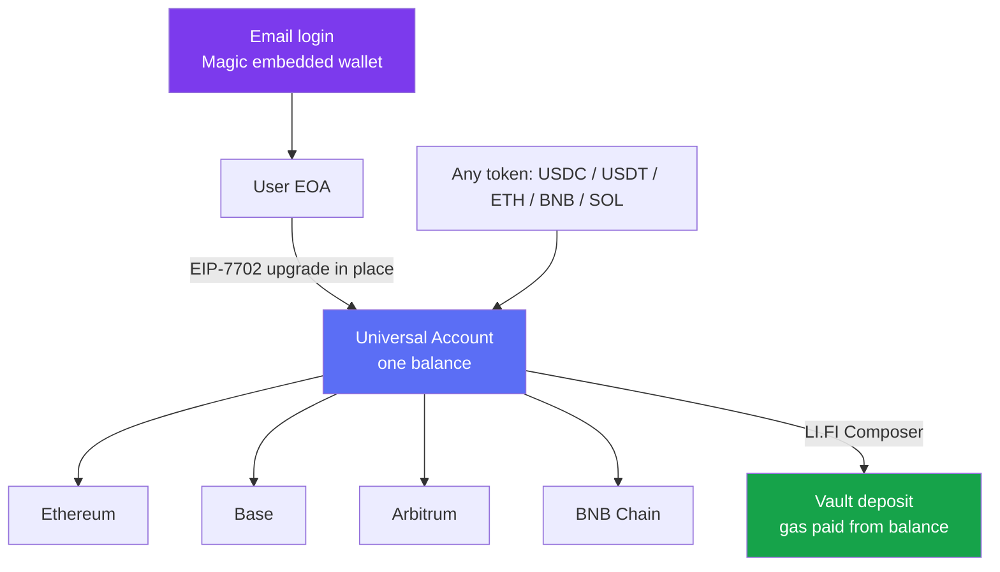

<p align="center">
  
</p>

<h1 align="center">Maroon</h1>

<p align="center">
  One-tap DeFi earning for everyone - log in with an email, deposit any token, earn real yield across every chain.
</p>

<p align="center">
  <a href="https://maroon-finance.vercel.app"><b>Live Demo</b></a>
  &nbsp;·&nbsp;
  <a href="frontend/docs/ARCHITECTURE.md"><b>Architecture</b></a>
</p>

---

Maroon is a consumer app that makes real DeFi yield feel like a modern savings app. Sign up with just an email, powered by **Magic**'s embedded wallet. Your wallet instantly becomes a chain-abstracted account through **Particle Network's Universal Accounts SDK in EIP-7702 mode** - one login, one balance, transactions on any chain with any asset. Browse live vaults pulled from **LI.FI Earn**, deposit with one tap paying in any token, and let **Maroon AI** build a diversified plan across chains. No seed phrase, no gas token to buy, no network switching, no crypto knowledge required.

> **One login. One balance. Every chain. One tap.**
>
> - **Login** -> Magic email OTP mints a real self-custodial wallet (no seed phrase).
> - **Account** -> Particle upgrades that wallet in place to a Universal Account (EIP-7702) that works on every chain at once.
> - **Deposit** -> pay in any token from any chain; LI.FI + the Universal Account route it into the vault, gas paid from your balance.

---

## What Makes Maroon Special

### Who This Is For

Meet Rara. She has some USDC and hears friends talk about earning 5-10% in DeFi, but every time she tries she hits a wall: install a wallet extension, write down twelve words, buy ETH "for gas" on the right network, bridge to another chain, approve a contract, and hope she didn't fat-finger an address. She wants the outcome (money that earns) without the obstacle course.

She is not going to learn what a "chain" is. She should not have to.

**Maroon is the outcome without the obstacle course.** She signs in with her email, sees vaults with clear yields, taps Deposit, and her balance starts earning - the wallet, the gas, the chains, and the routing all disappear behind one screen.

---

### The Problem

For a normal person, earning DeFi yield is a maze:

- **Wallets and seed phrases** - a browser extension and twelve secret words before anything happens
- **Gas tokens** - you must hold a chain's native token just to move, on every chain separately
- **Fragmented liquidity** - the best vault is on the "wrong" chain, so now you are bridging
- **Approvals and addresses** - one wrong click and funds are gone; most users freeze
- **No guidance** - even experts stare at dozens of vaults with no idea how to split

Every step is a place to give up. Most people do, before they ever earn a cent.

**How might we let anyone earn real DeFi yield with a single login and a single tap - no chains, no gas, no seed phrase - while their money is sourced and routed across chains automatically?**

---

### The Solution

Maroon solves this with six pieces built on Particle Universal Accounts, Magic, and LI.FI:

**1. Email Login via Magic** - The user signs in with an email one-time code (`loginWithEmailOTP`). Magic creates a real, self-custodial embedded wallet - no seed phrase, no extension. Onboarding feels like a normal consumer app.

**2. Universal Account in EIP-7702 mode (Particle)** - That Magic wallet is upgraded in place to a Universal Account with `useEIP7702: true`. No new address, no migration, no smart-account deployment. The user gets one unified balance that spans chains, and gas is paid from that balance - they never need a native gas token.

**3. Real Vault Data (LI.FI Earn)** - Maroon reads live vaults from LI.FI Earn across Ethereum, Base, Arbitrum, BNB, and more - real APY, real TVL, real protocols (Aave, Morpho, Pendle, Fluid, Ethena, Yearn, and others), server-proxied so the API key stays private.

**4. One-Tap, Any-Token, Cross-Chain Deposit** - The user picks a source token (USDC, USDT, ETH, BNB, SOL), types an amount, and taps Confirm. LI.FI's Composer builds the deposit calldata (`toToken` = vault) and the Universal Account sources the token across chains and executes it - a genuine cross-chain value movement. Gas is on the house (paid from the unified balance). The confirmation shows the real transaction with block-explorer and LI.FI Scan links.

**5. Invest with AI (Maroon AI)** - The user states a goal and an amount. Maroon AI returns a diversified plan split across several vaults and chains, with a blended yield and a risk read. One tap nudges it safer or bolder (Balanced / Make it safer / Chase more yield / Keep it simple). A deposit simulation previews the whole basket - and disables Confirm if the balance can't cover it - before depositing every leg through the Universal Account.

**6. One Portfolio** - Positions, token holdings, and activity in one place. Positions are read from the LI.FI Earn portfolio endpoint and joined to live vault data (name, APY, protocol, chain); the balance and holdings come from the Universal Account's primary assets.

---

## Chain Abstraction in Practice

Every deposit is the same one tap for the user, while the Universal Account does the cross-chain work underneath.

|  | **Simple deposit** | **Cross-token deposit** | **AI plan deposit** |
|---|---|---|---|
| **User action** | Pick vault -> amount -> Confirm | Pick vault -> pick a different pay token -> Confirm | State a goal -> review the plan -> Confirm |
| **Source** | Any chain in the unified balance | Any token (USDC/USDT/ETH/BNB/SOL) | The whole balance, split by the plan |
| **Routing** | LI.FI Composer quote (`toToken` = vault) | LI.FI swaps the pay token into the vault asset | One deposit per leg, across chains |
| **Execution** | `createUniversalTransaction` -> sign EIP-7702 auth (Magic) -> send | same | sequential legs via the Universal Account |
| **Gas** | Paid from the unified balance | Paid from the unified balance | Paid from the unified balance |
| **Result** | Position appears in the portfolio | "Cross-chain deposit" - auto-converted to the vault asset | A diversified basket, one confirmation |

### Why "one balance, any chain" matters

A user can hold USDC on Base and deposit into an Aave vault on Arbitrum without ever knowing a bridge happened. The Universal Account sources the token across chains and the deposit lands on the vault's chain - the entire "which chain am I on" problem disappears from the UX.

---

## Features

- **Email-Only Onboarding (Magic)**: sign in with an email OTP; a real self-custodial wallet is created behind the scenes, no seed phrase, no extension
- **Universal Account, EIP-7702 mode (Particle)**: the wallet is upgraded in place - one login, one balance, every chain, no new address or deployment
- **Gasless for the User**: gas and fees are paid from the unified balance; the user never buys or holds a native gas token
- **One-Tap Deposits, Any Token**: pay with USDC, USDT, ETH, BNB, or SOL; the amount follows the token (USD for stablecoins, token units otherwise)
- **Cross-Chain by Default**: LI.FI Composer + the Universal Account source and route value across chains; deposits into a different-chain vault are labelled "Cross-chain deposit"
- **Live Vault Marketplace (LI.FI Earn)**: real APY / TVL from Aave, Morpho, Pendle, Fluid, Ethena, Yearn and more, with category tabs, chain filters, search, and saved vaults
- **Invest with AI `NEW`**: state a goal, get a diversified multi-vault plan with a blended yield; nudge it safer or bolder; preview a deposit simulation (disabled on insufficient balance) before depositing the basket
- **Verifiable Deposits**: the success screen shows the transaction hash with per-chain block-explorer and LI.FI Scan links, animated with Framer Motion
- **One Portfolio**: Positions (LI.FI Earn portfolio, joined to live vault data), Holdings (unified balance), and Activity - with Balance, Deposited, and Blended APY
- **Dark Mode + Fully Responsive**: black-theme dark mode and a mobile-first pass across every page (viewport-safe modals, chip-strip filters, sticky mobile CTAs)

---

## Particle Network × Magic Labs × LI.FI Integration

Every deposit is signed by a Magic embedded wallet, executed by a Particle Universal Account in EIP-7702 mode, and routed by LI.FI. Core integration points:

| Component | File | Description |
|---|---|---|
| **Magic client** | [`lib/magic.ts`](https://github.com/0xpochita/maroon/blob/main/frontend/src/lib/magic.ts) | Singleton Magic instance (Base network); its embedded EOA can sign the EIP-7702 authorization Universal Accounts need |
| **Email login + balance** | [`stores/account.ts`](https://github.com/0xpochita/maroon/blob/main/frontend/src/stores/account.ts) | `loginWithEmailOTP`, `refresh` reads the Universal Account address + primary assets, `deposit` / `depositPlan` |
| **Universal Account** | [`lib/ua.ts`](https://github.com/0xpochita/maroon/blob/main/frontend/src/lib/ua.ts) | `newUniversalAccount({ smartAccountOptions: { useEIP7702: true } })`, `depositToVault`, `finalize` (sign 7702 auth per userOp + rootHash, then `sendTransaction`) |
| **Chain gating** | [`lib/ua-chains.ts`](https://github.com/0xpochita/maroon/blob/main/frontend/src/lib/ua-chains.ts) | `isUaChain` - deposits are gated to UA-supported chains (Ethereum, Base, Arbitrum, BNB) |
| **Vault data** | [`lib/lifi.ts`](https://github.com/0xpochita/maroon/blob/main/frontend/src/lib/lifi.ts) | `fetchVaults` (per chain, by TVL + APY, deduped, capped per protocol), `getPositions`, protocol + chain logo maps |
| **Deposit quote** | [`app/api/lifi/quote/route.ts`](https://github.com/0xpochita/maroon/blob/main/frontend/src/app/api/lifi/quote/route.ts) | Server proxy to the LI.FI Composer quote (`toToken` = vault); resolves the pay token per chain; key stays server-side |
| **Portfolio** | [`app/api/lifi/portfolio/[address]/route.ts`](https://github.com/0xpochita/maroon/blob/main/frontend/src/app/api/lifi/portfolio/[address]/route.ts) | Reads the LI.FI Earn portfolio and joins positions to live vault data |
| **Deposit UI** | [`components/(main)/EarnModal`](https://github.com/0xpochita/maroon/tree/main/frontend/src/components/(main)/EarnModal) | Token selector, cross-chain label, confirmation with explorer + LI.FI Scan links |
| **Invest with AI** | [`components/(main)/Invest`](https://github.com/0xpochita/maroon/tree/main/frontend/src/components/(main)/Invest) | Goal -> plan -> nudge -> deposit simulation -> multi-leg deposit |

### External Endpoints in Use

| API | Endpoint | Purpose |
|---|---|---|
| Magic | `magic.auth.loginWithEmailOTP` / `magic.wallet.sign7702Authorization` | Email login + signing the EIP-7702 upgrade |
| Particle UA | `UniversalAccount` SDK (`getPrimaryAssets`, `createUniversalTransaction`, `sendTransaction`) | Unified balance + cross-chain deposit execution |
| LI.FI Earn | `GET https://earn.li.fi/v1/vaults?chainId=...` | Live vaults (APY / TVL) for the marketplace |
| LI.FI Earn | `GET https://earn.li.fi/v1/portfolio/{address}/positions` | The user's active vault positions |
| LI.FI Composer | `GET https://li.quest/v1/quote` (`toToken` = vault) | Deposit calldata (swap + deposit) into the vault |

---

## Architecture

### Deposit Flow

```mermaid
sequenceDiagram
    participant User
    participant App as Maroon (Frontend)
    participant Magic as Magic (embedded wallet)
    participant UA as Particle Universal Account
    participant LiFi as LI.FI Composer
    participant Chain as Vault Chain

    User->>App: 1. Log in with email
    App->>Magic: 2. loginWithEmailOTP
    Magic-->>App: 3. embedded EOA + provider
    User->>App: 4. Pick vault, token, amount -> Confirm
    App->>LiFi: 5. Quote (fromToken -> toToken = vault)
    LiFi-->>App: 6. transactionRequest {to, data, value}
    App->>UA: 7. createUniversalTransaction (expectTokens + calldata)
    App->>Magic: 8. sign EIP-7702 authorization + rootHash
    UA->>Chain: 9. sendTransaction - source across chains, deposit
    Chain-->>User: 10. Position live; tx shown with explorer + LI.FI Scan
```

### Chain Abstraction



The user never selects a chain. The Universal Account sources the chosen token wherever it lives and lands the deposit on the vault's chain.

---

## Setup

```bash
cd frontend

# Install dependencies
pnpm install

# Configure environment variables
cp .env.example .env.local
# Edit .env.local (all server-side; never exposed as NEXT_PUBLIC):
#   MAGIC_API_KEY=pk_live_...          (Magic - login + EIP-7702 signer)
#   PARTICLE_PROJECT_ID=...            (Particle - Universal Accounts)
#   PARTICLE_CLIENT_KEY=...
#   PARTICLE_APP_ID=...
#   LIFI_API_KEY=...                   (LI.FI - vaults, portfolio, quote)

# Start the dev server
pnpm dev
```

Open [http://localhost:3000](http://localhost:3000). Without keys, the app runs in **mock mode** (the whole UI is clickable with mock account data and live vault data), so you can explore without any secrets. With keys filled in, log in with an email and deposit for real.

---

## How It Works

### User Flow

```
Log in with email -> Browse vaults -> Deposit any token -> Earn -> Check portfolio
```

1. **Log in** - email one-time code via Magic; a self-custodial wallet is created for you
2. **Browse** - live vaults by category and chain; save the ones you like
3. **Deposit** - pick a vault, pick a pay token, tap Confirm; the deposit is routed cross-chain, gas on us
4. **Earn** - the position starts earning; the confirmation links the on-chain transaction
5. **Portfolio** - see balance, deposited amount, blended APY, positions, holdings, and activity

### Invest-with-AI Flow

```
Goal + amount -> AI plan -> nudge -> simulate -> deposit basket
```

1. **Goal** - state what you want ("grow my savings safely") and an amount
2. **Plan** - Maroon AI returns a diversified split across vaults and chains with a blended yield
3. **Nudge** - one tap makes it safer or bolder; the plan re-thinks live
4. **Simulate** - a deposit preview shows the split, total, and balance check (Confirm is disabled if the balance is too low)
5. **Deposit** - every leg is deposited through the Universal Account

### Under the Hood

```
Magic embedded wallet (EOA)          Particle Universal Account            Chains
   │                                     │                                    │
   ├── email login ────────────────────►│                                    │
   │                                     ├── one unified balance (primary assets)
   ├── sign EIP-7702 authorization ─────►│  (upgrade the EOA in place)        │
   │                                     ├── createUniversalTransaction ──────►│  LI.FI Composer calldata
   │                                     ├── sendTransaction ─────────────────►│  source cross-chain + deposit
   │                                     │      gas paid from unified balance  │
   │                                     └── position + balance ◄──────────────┤
```

---

## Supported Chains, Tokens & Key Addresses

### Universal Account support (Particle, v2.0.3)

| Chain | Chain ID | Deposit supported |
|---|---|---|
| Ethereum | 1 | Yes |
| Base | 8453 | Yes |
| Arbitrum | 42161 | Yes |
| BNB Chain | 56 | Yes |
| X Layer | 196 | Supported by UA (no vaults shipped) |
| Solana | 101 | Non-EVM |

Primary assets (unified balance, sourceable across chains): **ETH, USDT, USDC, SOL, BNB**. The vault marketplace also lists Optimism, Polygon, and Avalanche vaults for discovery, where deposit is disabled (not UA-supported yet).

### Key addresses

| Contract | Address | Description |
|---|---|---|
| LI.FI Diamond | `0x1231DEB6f5749EF6cE6943a275A1D3E7486F4EaE` | Router for the Composer deposit (swap + deposit) |
| USDC (Arbitrum) | `0xaf88d065e77c8cC2239327C5EDb3A432268e5831` | Common deposit asset |
| USDC (Base) | `0x833589fCD6eDb6E08f4c7C32D4f71b54bdA02913` | Common deposit asset |
| wstETH (Base) | `0xc1CBa3fCea344f92D9239c08C0568f6F2F0ee452` | Lido liquid-staking vault token |

---

## Hackathon Submission

| | |
|---|---|
| **Track** | Particle Network - Universal Accounts Track (EIP-7702 mode) |
| **Bonus** | Magic Labs - Embedded Wallet Bonus Challenge (best / most creative embedded-wallet UX) |
| **Sponsors** | Particle Network · Magic Labs · LI.FI |
| **Live Demo** | [maroon-finance.vercel.app](https://maroon-finance.vercel.app) |

**Universal Accounts Track** - Maroon is built with Particle Network's Universal Accounts SDK in EIP-7702 mode. The user's EOA becomes a chain-abstracted account in place - one login, one balance, transactions on any chain with any asset. No new address, no migration, no smart-account deployment. Every vault deposit is a cross-chain operation moving value through the Universal Account.

**Magic Labs Bonus Challenge** - Onboarding is powered by Magic's embedded wallet: social-style email login, an invisible self-custodial wallet, and smooth authentication so Maroon feels like a modern consumer app rather than a crypto tool. The same embedded wallet signs the EIP-7702 upgrade that makes the Universal Account possible.

---

## License

MIT

---

> Real DeFi yield, in one tap - Maroon
